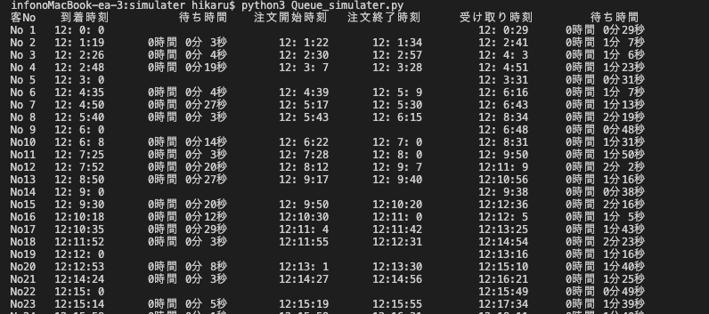
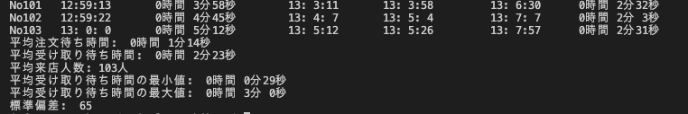

# Queueing-Simulater
テイクアウトを導入できるような飲食店において  
待ち行列理論を適用したテイクアウト専用のモバイルオーダーを導入する想定でシミュレーションを行う。  
各利用客の
```
客No,到着時刻,注文待ち時間,注文開始時刻,注文終了時刻,受け取り時刻,受け取り待ち時間
```
を表示し、最後に
```
平均受け取り待ち時間
平均来店人数
平均受け取り待ち時間の最小値
平均受け取り待ち時間の最大値
標準偏差
```
を表示する。

  
  

## 各ファイル
### Queue_simulater.py
待ち行列理論を適用したモバイルオーダーを導入した店舗を想定したシミュレータ。  
テイクアウトを導入できるような飲食店において待ち行列理論を適用したモバイルオーダーを導入する想定でのシミュレーションを行う。  
理想の混雑度を設定してモバイルオーダーを導入した際の混み具合を調整する。

###  Mo_simulater.py
従来のモバイルオーダーを導入した店舗を想定したシミュレータ。  
理論の効果を確認するための比較対象。

### rate_calculate.py
到着率とサービス率を行列計測データから導出するためのファイル。
行列計測は  
https://github.com/ryoctrl/QueueingMeasureApp  
https://github.com/ryoctrl/Queue-Backend  
を使用した。

## 使用手順
拡張モジュールのインストール
```
$ pip3 install numpy
```
各ファイルはpython3で実行可能
```
$ python3 [filename].py
```
### 重要パラメータ
よく調節する値の説明  
times ... シミュレーション回数  
arrival_rate ... 到着率(人/時間)  
service_rate ... サービス率(人/時間)  
ideal_crowd ... 理想の混雑度  
arrival_rate ... 実際の店舗の到着率(人/時間)
